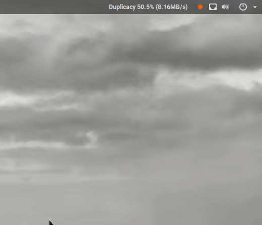

A Gnome tray icon for [Duplicacy](https://duplicacy.com/), showing time until next backup and current upload rate. Also allows for pausing, running, and viewing the log file.

## Requirements
Requirements
- Gnome 3.x
- [Argos extension](https://github.com/p-e-w/argos)
- `humanfriendly` and `croniter` for the python script to obtain next runtime from cron

## Assumptions
This assumes only 1 duplicacy back is running.

## Use
Copy the shell script to `~/.config/argos` and set `+x`.

With duplicacy, use `-stats` and output to a logfile. E.g.,
`duplicacy backup -stats &> ~/duplicacy.backup.log`

In the shell script, set the location of the backup log file (`backuplog`) and the location of where the file used to set pause/unpaused (`pausedfile`). Setting a relative path does not seem to work.

Set `croniter("*/30 * * * *"` in the inline python script to be your crontab pattern for the duplicacy backup.

In the scriptname (`monitor_duplicacy.2s.sh`) change, change `2s` to be the frequency the monitor is run.

